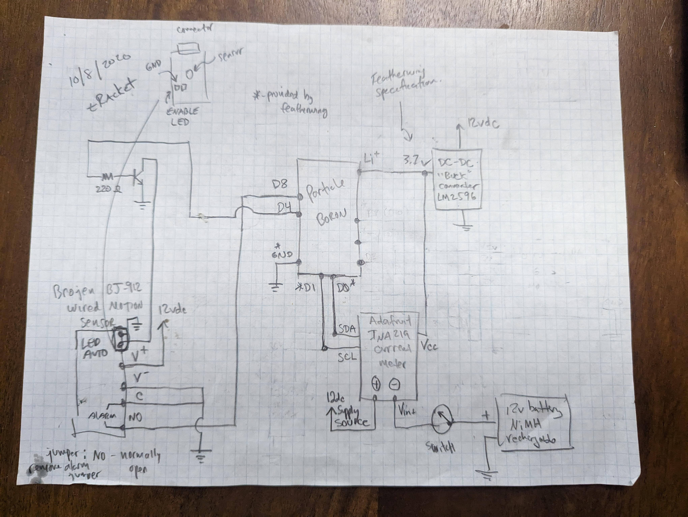

# tRacket Particle

This is the Particle Workbench project that contains the code for the courtside tRacket device itself. 

## Architecture

There are three main components to the tRacket system: the tRacket courtside device, an MQTT Broker provided by [Adafruit.io](https://io.adafruit.com/), and an If This Than That (IFTTT) Applet.

### tRacket courtside device

The tRacket courtside device maintains an MQTT connection to [Adafruit.io](https://io.adafruit.com/).  Whenever there is a change in occupancy on the court, a message is sent from the tRacket device in this format:

2023/07/23 05:57:54PM	CoopertownElementary:1	
...	
2023/07/23 12:54:26PM	CoopertownElementary:0

With a pattern of: <date time> <tRacket ID>:<Occupancy, 1-Occuped, 0-Available>
