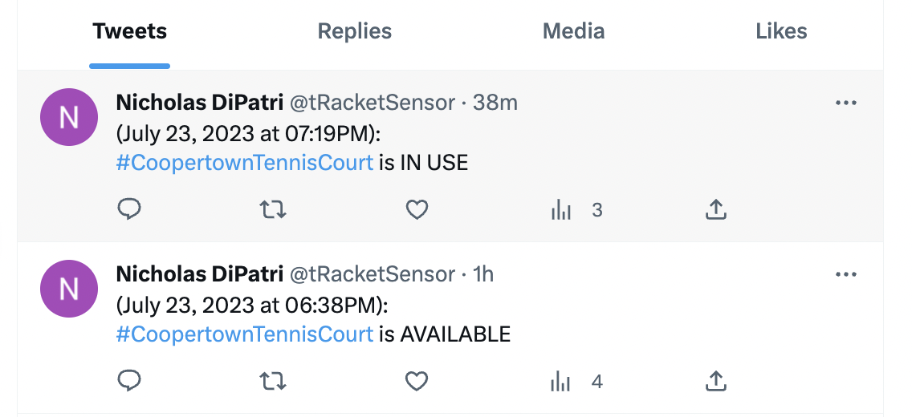
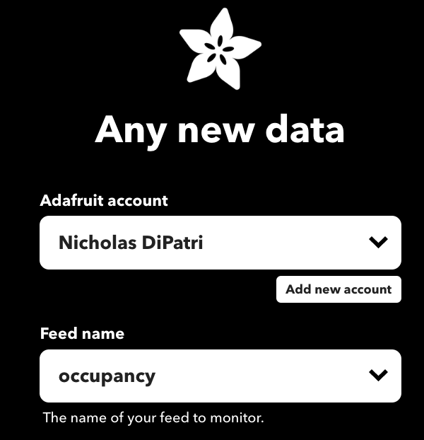
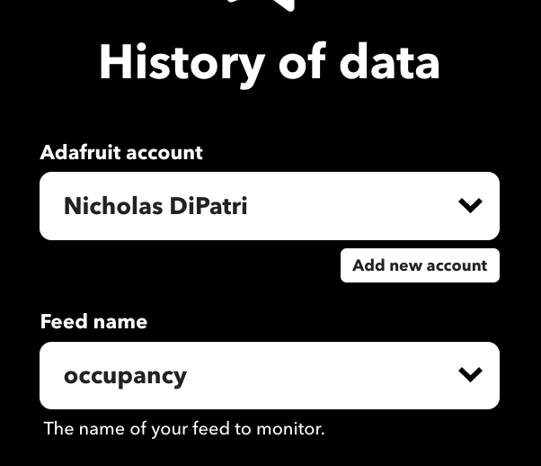
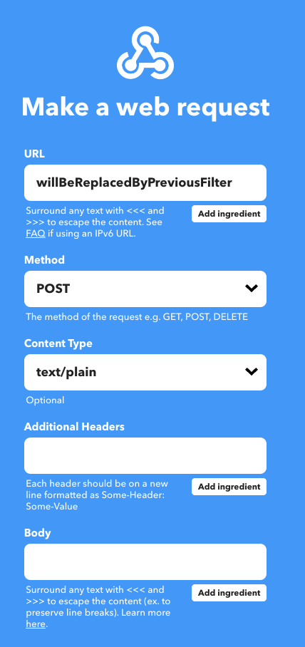

# tRacket Particle

This is the Particle Workbench project that contains the code for the courtside tRacket device itself. 

I recommend viewing this README with 'Outline' view turned on: 

## Architecture

There are three main components to the tRacket system: the tRacket courtside device, an MQTT Broker provided by [Adafruit.io](https://io.adafruit.com/), and an Applet on the [If This Than That (IFTTT)](https://ifttt.com/) Integration Server.

The result is whenever the tRacket device detects the beginning or ending of court occupation, a Tweet is sent.

### tRacket courtside device

The tRacket [Particle](https://www.particle.io/devices/) microcontroller-based courtside device has an LTE wireless radio and can establish an MQTT connection to [Adafruit.io](https://io.adafruit.com/).  Whenever there is a change in occupancy on the court, a message is sent from the tRacket device in this format:

`2023/07/23 05:57:54PM	CoopertownElementary:1`

With a pattern of: |dateTime|tRacketID|:|Occupancy, 1-Occuped, 0-Available|

The tRacket device has a custom 12-volt NiHM battery pack that is charged by a solar panel (as shown in picture above).

### Adafruit.io MQTT Broker

[Adafruit.io](https://io.adafruit.com/) has a $10/month subscription service for devices that need to push data up to the cloud for asynchronous access.  Given the tRacket device is powered by solar and its only network connection is a very cheap LTE radio, we don't want end-consumers to connect directly to the tRacket device.  The Adafruit MQTT Broker is a perfect intermediary.

The tRacket device pushes data up to the 'occupancy' and 'recharge' MQTT topics.  When you push up to Adafruit.io, the topics or 'feeds' are created dynamically. So there is very little you need to configure on Adafruit.io for this to all work.

The 'occupancy' feed contains the occupancy data described previously.  The 'recharge' feed contains a message if the tRacket device gets low on power.  This would be useful for identifying if the solar panels are no longer charging the batteries affectively. 

**My single tRacket device has been running on solar power with no problems for over two years as of July 2023.**

### If This Than That (IFTTT) Integration Server

The If This Than That (IFTTT) Integration Server monitors the Adafruit.io 'occupancy' feed and delivers a message to the [tRacketSensor Twitter Handle](https://twitter.com/tRacketSensor).  Here is an example message:

From the above Tweet history, we can see that the court was occupied but then became available on July 23, 2023 at 06:38PM.  It remained available for 41 minutes until it became occupied again at 07:19PM.

My IFTTT account has been configured with two Applets.  The first detects a change in the Adafruit.io 'occupancy' feed and then passes that data in a webhook back to the second Applet which responds by formulating the above message and posting a Tweet.

Configuring these two Applets it's rather tedious and involves the following details:

#### Two Applets are needed. ####

#### First Applet ####

'Receives Occupancy Feed update and POSTs to "tRacketTweet" WebHook'

##### First Applet requires three steps: #####

###### First Applet: If: 'Any new data' #####

###### First Applet: With: 'History of data' ######

###### First Applet: When: 'Filter code' ######

###### First Applet: Then: 'Make a web request' ######

#### Second Applet ####

'Receives "tRacketTweet" WebHook then tweets to @tRacketSensor'

##### Second Applet requires two steps: #####

###### Second Applet: If: 'Receive a web request' #####

###### Second Applet: Then: 'Post a Tweet' ######

### Parts List ###

#### 12V Solar Panel with Charging Circuit ####
I also used a [Solar Panel kit](https://www.amazon.com/gp/product/B08GX19KT9/ref=ppx_yo_dt_b_search_asin_title?ie=UTF8&psc=1).  The charging terminals from the solar panel attach directly across the 12v NiMH battery pack. (+ to +, - to -)

#### Rechargeable Battery Pack ####

The battery pack is custom built from [10 1.2V 2800mAH NiHM batteries](https://www.amazon.com/gp/product/B07PJZKB8X/ref=ppx_yo_dt_b_search_asin_title?ie=UTF8&psc=1).  They are soldered in series. 8 are in one pack and 2 are in another.  This arrangement was made to be able to fit the batteries most efficiently in the 3D enclosure. The 2-pack fit under the circuit board. Lots of electrical tape is used to prevent shorts anywhere.

#### DC-DC Buck Converter ####

The [DC-DC Buck Converter](https://www.amazon.com/Adjustable-Converter-1-5-35v-Efficiency-Regulator/dp/B07C2QF1T1/ref=sr_1_1_sspa?dchild=1&keywords=buck+converter&qid=1609001107&sr=8-1-spons&psc=1&spLa=ZW5jcnlwdGVkUXVhbGlmaWVyPUEzMDVDREpLWDZDM1FUJmVuY3J5cHRlZElkPUEwMzc4NDk1MUpOTlRHQVVaTUNPViZlbmNyeXB0ZWRBZElkPUEwNzUxMTYwMUpFTVFNUDRTQ04wWSZ3aWRnZXROYW1lPXNwX2F0ZiZhY3Rpb249Y2xpY2tSZWRpcmVjdCZkb05vdExvZ0NsaWNrPXRydWU=) is what converts our 12V battery to 3.7V for the micro-controller.  It has a micro-potentiometer that is used to manually adjust down the Vout.

#### Particle Boron MicroController ####

The [Boron](https://www.amazon.com/PARTICLE-Development-Endpoints-Circuitry-Bluetooth/dp/B07N96P69L/ref=sr_1_1?dchild=1&keywords=particle+boron&qid=1609000793&sr=8-1) is a Arduiono-based Microcontroller with LTE cellular network connectivity.

#### Motion Sensor (Brojen BJ-912)  ####

The [Brojen BJ-912](https://www.amazon.com/BROJEN-Brojen-BJ-912-Curtain/dp/B07C53ZS2Y/ref=sr_1_1?dchild=1&keywords=Brojen+BJ-912&qid=1609000375&sr=8-1) motion sensor is placed directly inside the 3D enclosure.  This sensor requires 12V which is why we have a 12V supply.  

Changes need to be made on the inside of the motion sensor. The 'Normally Open (NO)' jumper needs to be removed and the 'LED ON' (i.e. 'Enable LED') jumper wires need to be brought outside of the sensor as shown.  The 'Enable LED' signal is set by the microcontroller as the LED is enabled with tRacket is in 'test' mode.

### Assembly Instructions ###

#### Schematic ####

